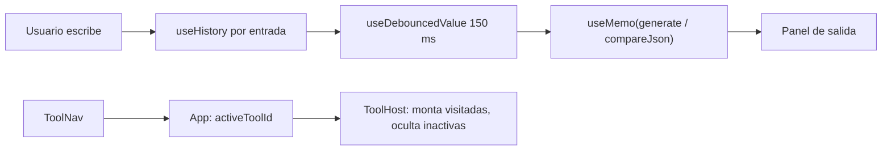

# Plan 002 — Registro de herramientas

Spec: [spec.md](./spec.md)

## Resumen técnico

Se extrae la lógica de "qué generador llamar para cada (entrada, salida)" del `useEffect` de `App.tsx` a un servicio puro
`generate()`, blindado **antes de tocar la UI** por un test de paridad que reproduce la tabla de decisión actual.
Después se introduce un catálogo de herramientas (datos puros, testeable) y un registro que le asocia icono y componente
cargado con `React.lazy`. Cada herramienta es un módulo autónomo en `src/tools/<id>/` que posee su propio estado; la carcasa
(`App.tsx`) solo pinta cabecera, navegación y la herramienta activa. Las herramientas visitadas se mantienen montadas
(ocultas) para conservar su estado al cambiar entre ellas sin introducir un store global.

## Check de constitución
| Principio | Cumple | Nota |
|-----------|--------|------|
| P1 Spec primero | Sí | Spec aprobada; este plan pendiente de aprobación. Ver "Cambios de spec propuestos". |
| P2 Servicios puros | Sí | `generate()`, `resolveOutputMode()` y el catálogo son funciones/datos puros sin React. Los textos de estado vacío de Comparar se calculan con una función pura. |
| P3 Tests como contrato | Sí | Paridad, catálogo, estado vacío de Comparar y textos en español con tests Jest. Navegación, layout y tiempos de respuesta, verificación manual en `checklist.md` (no hay entorno DOM en Jest). |
| P4 Tipado estricto | Sí | Sin `any` nuevo. `ToolId`, `InputKind` y `OutputMode` como uniones literales; `SUPPORTED_OUTPUTS` con `satisfies`. |
| P5 Atomic design | Excepción justificada | Las herramientas viven en `src/tools/<id>/` y actúan como *páginas* (nivel por encima de `templates`). Las piezas reutilizables que surgen van a su nivel atómico (`ToolNav` organismo, `ToolWorkspace` template, `InputActions` y `PasteButton` moléculas, hooks en `src/hooks/`). Ver D2. |
| P6 Sin regresiones | Sí | Baseline abajo. Objetivo: lint ≤ 19 errores, 1 fallo conocido no relacionado, build OK, chunk inicial ≤ baseline. |
| P7 Dependencias mínimas | Sí | Sin dependencias nuevas. Se descarta añadir jsdom/Testing Library (D6). |
| P8 Estilo | Sí | Esta feature traduce los textos visibles al español (US7). |
| P9 Análisis de impacto | Sí | Ver "Archivos afectados". CodeGraph no estaba disponible en esta sesión; el impacto se obtuvo con búsqueda textual sobre `src/` (repositorio pequeño: 3.662 líneas). |

## Baseline
Medida el 2026-10-08 sobre `main` (2416fb2 + docs sin commitear).

| Gate | Resultado |
|------|-----------|
| `npm run build` | OK. Chunk inicial `index-*.js` 296,39 kB (92,19 kB gzip); `index-*.css` 49,3 kB. Mermaid ya se carga con `import()` dinámico. |
| `npm run lint` | 19 errores (0 warnings): `any` en tests y `converter.ts`, variables sin usar en `formatter.ts`/`ImportMenu.tsx`/`Switch.tsx`, hook condicional en `Switch.tsx`, `set-state-in-effect` en `ThemeContext.tsx` y `useJsonValidation.ts`, `only-export-components` en `ThemeContext.tsx`. |
| `npm test` | 48 pasan / 1 falla: `converterEnhancement.test.ts › should detect union types in mixed arrays` (preexistente, ajeno a esta feature). |

## Diseño

### Módulos y responsabilidades

**Servicios (puros)**
- `services/generate.ts` *(nuevo)* — Tabla de decisión entrada × salida. Llama a los generadores existentes con los mismos parámetros que hoy (`rootName: "Root"` para JSON, `"JwtPayload"` para JWT). Devuelve un resultado discriminado, no lanza excepciones.
- `services/converter.ts` *(modificado)* — `OutputMode` pierde `'compare'`.
- `services/comparator.ts` *(modificado)* — `DIFF_LABELS` en español. `compareJson` no cambia.

**Herramientas**
- `tools/catalog.ts` *(nuevo)* — Metadatos puros de las herramientas (id, nombre, descripción) en orden de navegación. Sin iconos ni componentes, para poder testearlo en Jest (entorno node, solo `.ts`).
- `tools/registry.ts` *(nuevo)* — Une cada entrada del catálogo con su icono de `lucide-react` y su componente `React.lazy`. **Único punto que se toca para añadir una herramienta** (NFR-001).
- `tools/generate/GenerateTool.tsx` — Entrada JSON/Java/JWT, selector de salida derivado de `SUPPORTED_OUTPUTS`, tipo de diagrama, formatear/minificar, deshacer/rehacer, importar, exportar.
- `tools/compare/CompareTool.tsx` + `tools/compare/compareMessages.ts` (puro) — Dos editores con historial propio; informe con `CompareReport`.
- `tools/jwt/JwtTool.tsx` — Entrada de token; salida con `JwtInfo` y payload formateado en editor de solo lectura.
- `tools/mermaid/MermaidTool.tsx` — Entrada de texto; salida `MermaidPreview`.

**Hooks**
- `hooks/useDebouncedValue.ts` *(nuevo)* — Valor retrasado 150 ms; solo emite el último (AC-6.4).
- `hooks/useHistory.ts` — Se reutiliza sin cambios, una instancia por entrada.
- `hooks/useJsonValidation.ts` — Se reutiliza sin cambios.

**Componentes**
- `organisms/ToolNav.tsx` *(nuevo)* — `<nav aria-label="Herramientas">`: lista de botones con `aria-current="page"` en `md:` y `<select>` nativo en móvil (AC-1.2, 1.3, 1.5).
- `organisms/ToolHost.tsx` *(nuevo)* — Monta de forma perezosa las herramientas visitadas, oculta las inactivas con `hidden` y envuelve cada una en `Suspense` (D3).
- `templates/MainLayout.tsx` *(modificado)* — Pasa a `header` + `nav` + `children`; las dos columnas se mueven a `ToolWorkspace`.
- `templates/ToolWorkspace.tsx` *(nuevo)* — Paneles de entrada y salida con el mismo estilo que hoy, más una cabecera de panel (título + controles).
- `molecules/InputActions.tsx` *(nuevo)* — Deshacer, rehacer, formatear, minificar y limpiar, con `aria-label` en español.
- `molecules/PasteButton.tsx` *(nuevo)* — "Pegar del portapapeles" con aviso en español si se deniega el permiso.
- `molecules/ExportMenu.tsx` *(modificado)* — Prop `outputMode: OutputMode` tipada; textos en español.
- `molecules/ImportMenu.tsx`, `JwtInfo.tsx`, `CompareReport.tsx`, `atoms/ThemeToggle.tsx`, `organisms/CodeEditor.tsx` *(modificados)* — Solo textos.
- `App.tsx` *(reescrito)* — Carcasa de menos de 100 líneas: `ThemeProvider`, `MainLayout`, `ToolNav`, `ToolHost` y el estado de la herramienta activa.

### Contratos
```ts
// services/converter.ts
export type OutputMode = 'interface' | 'type' | 'zod' | 'mermaid' | 'deserialize';

// services/generate.ts
export type InputKind = 'json' | 'java' | 'jwt';

export const SUPPORTED_OUTPUTS = {
  json: ['interface', 'type', 'zod', 'mermaid', 'deserialize'],
  java: ['interface', 'type', 'zod', 'mermaid'],
  jwt:  ['interface', 'type', 'zod', 'mermaid', 'deserialize'],
} as const satisfies Record<InputKind, readonly OutputMode[]>;

export interface GenerateOptions {
  diagram: MermaidDiagram;
}

export type GenerateResult =
  | { ok: true; output: string }
  | { ok: false; error: string };

/** Devuelve `mode` si la entrada lo soporta; si no, la primera salida soportada. */
export function resolveOutputMode(kind: InputKind, mode: OutputMode): OutputMode;

/** Umbral de AC-6.2/6.3. */
export const LARGE_INPUT_CHARS = 100 * 1024; // ajustado en T003: se mide en caracteres
export function isLargeInput(text: string): boolean;

/** Entrada vacía o solo espacios → { ok: true, output: '' }. Nunca lanza. */
export function generate(
  input: string,
  kind: InputKind,
  mode: OutputMode,
  options: GenerateOptions,
): GenerateResult;

// tools/catalog.ts
export type ToolId = 'generate' | 'compare' | 'jwt' | 'mermaid';
export interface ToolMeta {
  id: ToolId;
  label: string;        // "Generar tipos"
  description: string;  // una frase, en español
}
export const TOOL_CATALOG: readonly ToolMeta[];
export const DEFAULT_TOOL_ID: ToolId; // 'generate'

// tools/registry.ts
export interface ToolDefinition extends ToolMeta {
  icon: LucideIcon;
  Component: LazyExoticComponent<ComponentType>;
}
export const TOOLS: readonly ToolDefinition[];

// tools/compare/compareMessages.ts
export function compareEmptyMessage(expected: string, actual: string):
  { title: string; description: string } | null; // null si ambas tienen contenido

// hooks/useDebouncedValue.ts
export function useDebouncedValue<T>(value: T, delayMs?: number): T; // por defecto 150

// components/templates/MainLayout.tsx
interface MainLayoutProps { header: ReactNode; nav: ReactNode; children: ReactNode; className?: string }
```

En JWT, `generate()` decodifica el token internamente. La herramienta "Generar tipos" llama además a `decodeJwtPayload` para pintar el badge, sin duplicar lógica de generación.

### Flujo de datos


El cálculo es síncrono dentro de `useMemo` sobre el valor ya retrasado: no hay estado `isProcessing`, ni timers con `setState`, ni resultados obsoletos (AC-6.4, AC-2.6).

## Archivos afectados
| Archivo | Cambio | Consumidores afectados |
|---------|--------|------------------------|
| `src/services/generate.ts` | nuevo | herramientas `generate` (y `jwt` indirectamente vía `decodeJwtPayload`) |
| `src/services/converter.ts` | modificado (`OutputMode` sin `'compare'`) | `App.tsx` (se reescribe), `ExportMenu.tsx` (pasa a usar el tipo), `comparator.ts` (usa `outputMode: 'interface'`, compatible), tests que llaman a `jsonToTypeScript` con `'interface'`/`'type'` (compatibles) |
| `src/services/comparator.ts` | modificado (`DIFF_LABELS` en español) | `CompareReport.tsx`. Ningún test usa `DIFF_LABELS`. |
| `src/tools/catalog.ts`, `src/tools/registry.ts` | nuevos | `App.tsx`, `ToolNav`, `ToolHost` |
| `src/tools/{generate,compare,jwt,mermaid}/*` | nuevos | `registry.ts` |
| `src/hooks/useDebouncedValue.ts` | nuevo | las cuatro herramientas |
| `src/components/organisms/ToolNav.tsx`, `ToolHost.tsx` | nuevos | `App.tsx` |
| `src/components/templates/ToolWorkspace.tsx` | nuevo | las cuatro herramientas |
| `src/components/templates/MainLayout.tsx` | modificado (props) | `App.tsx` (único consumidor) |
| `src/components/molecules/InputActions.tsx`, `PasteButton.tsx` | nuevos | `generate`, `compare`, `jwt`, `mermaid` |
| `src/components/molecules/ExportMenu.tsx` | modificado (tipo + textos) | `GenerateTool` |
| `src/components/molecules/ImportMenu.tsx` | modificado (textos) | `GenerateTool`, `CompareTool` |
| `src/components/molecules/JwtInfo.tsx` | modificado (textos) | `JwtTool` (sale de "Generar tipos", AC-4.3) |
| `src/components/molecules/CompareReport.tsx` | modificado (textos) | `CompareTool` |
| `src/components/organisms/MermaidPreview.tsx` | sin cambios | `MermaidTool` |
| `src/components/organisms/CodeEditor.tsx` | modificado (texto de carga) | todas las herramientas |
| `src/components/atoms/ThemeToggle.tsx` | modificado (textos) | `App.tsx` |
| `src/App.tsx` | reescrito como carcasa | `main.tsx` (sin cambios) |

## Estrategia de tests
| AC | Tipo | Archivo de test / verificación |
|----|------|--------------------------------|
| AC-1.1 | unitario + manual | `src/__tests__/toolCatalog.test.ts` (4 herramientas, orden, ids únicos, `DEFAULT_TOOL_ID = 'generate'`, nombre y descripción no vacíos). Iconos: manual. |
| AC-1.2, 1.3, 1.5 | manual | Escritorio 1280 px y móvil 375 px; navegación solo con teclado; `aria-current` en DevTools. |
| AC-1.4 | manual | Escribir en Generar tipos (Zod + texto), ir a Comparar y volver. |
| AC-2.1, 2.2 | unitario | `src/__tests__/generate.test.ts` sobre `SUPPORTED_OUTPUTS`. Selector: manual. |
| AC-2.3 | manual | Selector Clase/ER/Flujo visible solo con salida Mermaid. |
| AC-2.4 | unitario | `generate.test.ts`: matriz de 20 combinaciones × 5 fixtures. El oráculo del test es la tabla de llamadas copiada del `useEffect` actual (`App.tsx:142-183`). Se escribe y pasa **antes** de reescribir la UI. |
| AC-2.5 | unitario + manual | `resolveOutputMode('java', 'deserialize') === 'interface'`; en la UI, el selector refleja el cambio. |
| AC-2.6 | unitario + manual | `generate()` con JSON, Java y JWT inválidos devuelve `ok: false`. Badges: manual. |
| AC-2.7, 2.8 | manual | Exportar las 4 extensiones; formatear, minificar, deshacer y rehacer. |
| AC-3.1, 3.1b, 3.4 | manual | Escritorio con dos editores visibles; móvil con pestañas; Limpiar en cada uno. |
| AC-3.2 | unitario | `src/__tests__/comparator.test.ts` (nuevo): `compareJson` para el ejemplo de la spec y casos básicos, para fijar el informe actual. |
| AC-3.3 | unitario | `src/__tests__/compareMessages.test.ts`: 4 combinaciones vacío/no vacío. |
| AC-4.1, 4.2, 4.3 | manual | Token válido (HS256 con `exp`), token con 2 partes y JWE. En Generar tipos con JWT no aparece `JwtInfo`. |
| AC-5.1, 5.2 | manual | Diagrama válido e inválido; zoom y ajuste. |
| AC-6.1–6.4 | manual | Performance panel: tiempo entre la última tecla y el commit de la salida; sin esqueleto con un JSON pequeño; JSON > 100 KB (ver cambio de spec propuesto). |
| AC-7.1, 7.2 | unitario + manual | `src/__tests__/uiStrings.test.ts`: recorre `src/**/*.tsx` con `fs` y falla si aparece alguno de los textos en inglés de AC-7.2. Revisión visual de todos los estados. |
| NFR-002 | unitario | `uiStrings.test.ts` (o un test hermano) comprueba que `App.tsx` tiene menos de 100 líneas. |
| NFR-003, NFR-005 | gates | `npm run build`, `npm run lint`, `npm test` contra la baseline; tamaño de `index-*.js` ≤ 296,39 kB. |

## Riesgos y mitigaciones
| Riesgo | Probabilidad | Impacto | Mitigación |
|--------|--------------|---------|------------|
| Romper una combinación de la matriz al mover la lógica | Media | Alto | El test de paridad (AC-2.4) es la primera tarea y su oráculo replica la tabla actual. |
| Varias instancias de Monaco montadas a la vez (ocultas) consumen memoria | Media | Medio | Montaje perezoso: solo se montan las herramientas visitadas (como máximo 5 editores). Si molesta, el plan de 004 puede elevar el estado y desmontar. |
| Monaco no recalcula el tamaño al mostrar un editor oculto | Media | Medio | `automaticLayout: true` ya está activo; verificación manual al alternar herramientas y pestañas en móvil. |
| `React.lazy` hace parpadear el primer cambio de herramienta | Baja | Bajo | Fallback de `Suspense` con el mismo esqueleto de paneles. |
| El textscan de `uiStrings.test.ts` da falsos positivos (p. ej. "Type" como término técnico) | Media | Bajo | Lista negra de frases completas de AC-7.2 ("Copy to Clipboard", "Waiting for inputs"…), no palabras sueltas. |
| Cambiar `DIFF_LABELS` rompe algo que dependa del texto en inglés | Baja | Bajo | Único consumidor: `CompareReport`. |

## Decisiones
- **D1 — Servicio `generate()` con resultado discriminado.** Alternativas: dejar la tabla de decisión dentro de la herramienta (no testeable en Jest, contra P2) o que cada `Tool` declare un mapa salida → función (dispersa la paridad en varios archivos). Motivo: un único punto puro y testeable que reproduce el comportamiento actual.
- **D2 — Herramientas como módulos de nivel "página" en `src/tools/<id>/`.** Alternativa: meterlas en `components/organisms`. Motivo: cada herramienta compone organismos y templates y tiene estado propio. Es el nivel *pages* del atomic design, que el proyecto aún no tenía.
- **D3 — Conservar el estado manteniendo montadas las herramientas visitadas.** Alternativas: store global por herramienta (más código y estado serializable que hoy nadie necesita) o desmontar y perder el estado (incumple AC-1.4). Motivo: cero infraestructura, también conserva el historial de deshacer, el cursor y el scroll. La 004 decidirá si eleva el estado para persistirlo.
- **D4 — Contrato `Tool` con un único `Component`** en lugar de "componente de entrada + componente de salida" como sugería el roadmap. Motivo: entrada y salida comparten estado (historial, modo, resultado); separarlas obliga a elevar el estado o a usar un contexto por herramienta. El layout común de dos paneles se reutiliza con el template `ToolWorkspace`.
- **D5 — Metadatos (`catalog.ts`) separados del registro (`registry.ts`).** Motivo: Jest corre en node solo con `.ts`, y los iconos de `lucide-react` y los componentes `.tsx` no se pueden importar ahí. Así los metadatos sí se testean.
- **D6 — Sin jsdom ni Testing Library.** Motivo: P7. Los AC de UI se verifican de forma manual y quedan registrados en `checklist.md`, como prevé P3.
- **D7 — Navegación móvil con `<select>` nativo.** Alternativa: menú desplegable propio. Motivo: accesible y operable por teclado sin código extra, y sin scroll horizontal.
- **D8 — Comparar en móvil con CSS (`md:`), sin `matchMedia`.** Los dos editores se montan siempre; en móvil se oculta el inactivo y se muestran pestañas `md:hidden`.
- **D9 — Importar vive en la barra de cada entrada,** no en la cabecera global. Motivo: la cabecera no conoce el estado de la herramienta activa (D3). Se muestra en "Generar tipos" y en cada editor de "Comparar"; no en JWT ni Mermaid, porque el menú solo importa JSON. Requiere ajustar FR-002 (ver abajo).
- **D10 — `DIFF_LABELS` se traduce en el servicio** en lugar de mapearse en la UI. Motivo: un solo origen de verdad; AC-3.2 se refiere a las diferencias detectadas, no al texto de las etiquetas.

## Cambios de spec (aprobados el 2026-10-08 y aplicados en spec.md)
1. **AC-6.2 / AC-6.3** — El cálculo es síncrono en el hilo principal. Un cálculo de más de 300 ms bloquea el render, así que el esqueleto no puede llegar a pintarse mientras dura (y los Web Workers están fuera de alcance). Propuesta medible:
   - AC-6.2 → "Dada una entrada de 100 KB o menos, cuando se actualiza la salida, no aparece ningún esqueleto de carga."
   - AC-6.3 → "Dada una entrada de más de 100 KB, cuando se recalcula, se pinta el esqueleto antes de iniciar el cálculo y se mantiene hasta que aparece la salida."
   Diseño (ajustado en /sdd-tasks): no hace falta un timer adicional. Mientras `input !== debouncedInput` y `isLargeInput(input)`, la herramienta pinta el esqueleto. Cuando llega el valor retrasado, el `useMemo` calcula en ese render y el esqueleto ya pintado sigue en pantalla hasta el commit con la salida.
2. **FR-002** — "La importación (archivo o URL) y el pegado desde el portapapeles escriben en la entrada en cuya barra o estado vacío se pulsaron. En Comparar, cada editor tiene los suyos." Sustituye la regla de "la última entrada que recibió el foco" (D9).

## Fases
1. **Red de seguridad** — `comparator.test.ts`, test de paridad y `generate.ts` (rojo → verde), `resolveOutputMode`, `OutputMode` sin `'compare'`.
2. **Infraestructura** — `catalog.ts` y su test, `useDebouncedValue`, `MainLayout` + `ToolWorkspace`, `ToolNav`, `ToolHost`, `InputActions`, `PasteButton`.
3. **Herramientas** — las cuatro (P1 primero), con la regla del esqueleto (US6) en Generar y Comparar. Se juntan aquí porque el registro necesita los cuatro componentes.
4. **Integración** — `registry.ts`, `MainLayout`, `App.tsx` como carcasa, `OutputMode` sin `'compare'`.
5. **Español** — textos de los componentes, `DIFF_LABELS` y `uiStrings.test.ts`.
6. **Verificación** — gates contra la baseline, tamaño del bundle y verificación manual en `checklist.md`.
